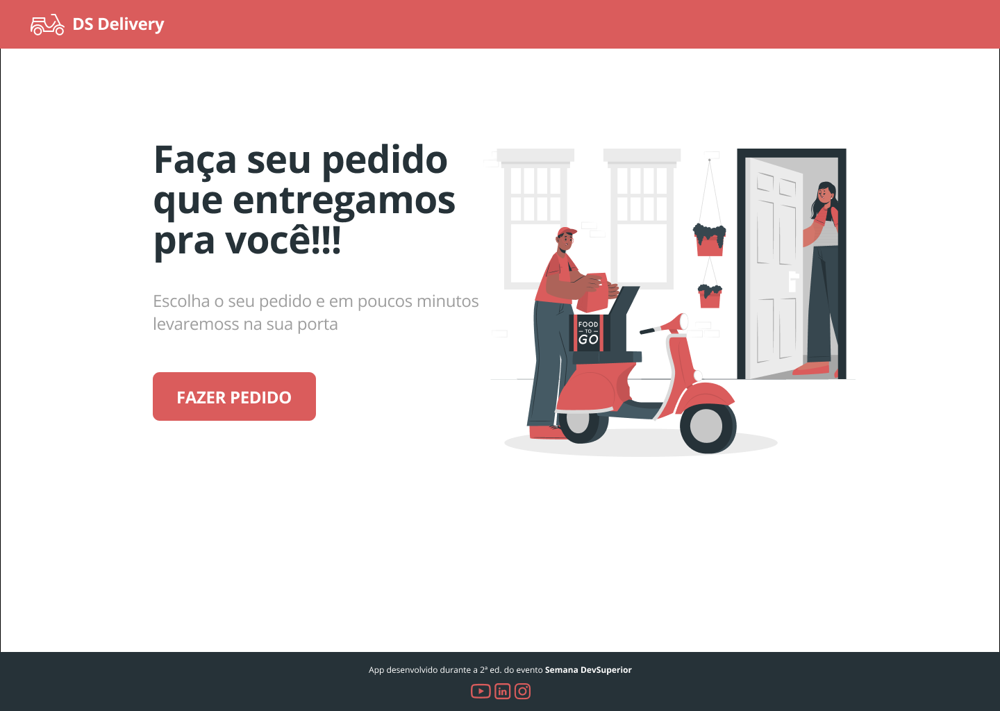
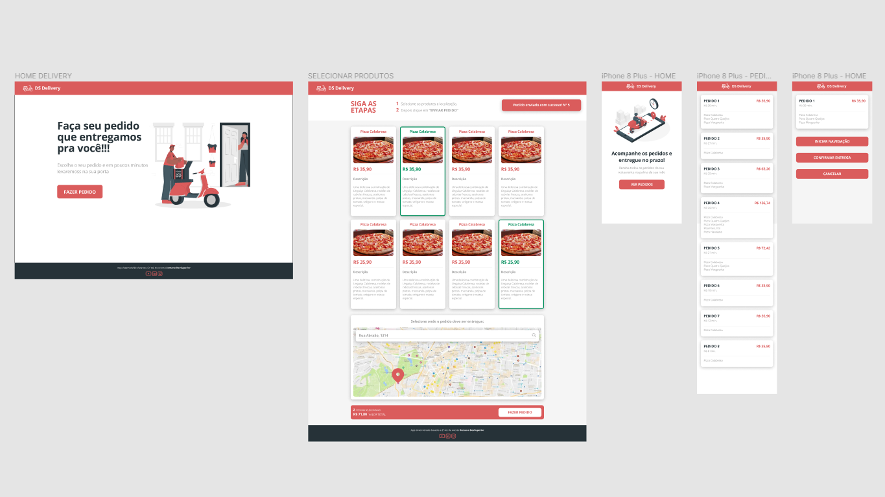

<h2 align="center">
   DSDeliver - Semana DevSuperior 2.0
</h2>

   

<h3 align="center">
   

   

   

   

   

   
    
    

   
</h3>

[**Sobre**](#-sobre) &nbsp;&nbsp;**|**&nbsp;&nbsp;
[**Tecnologias utilizadas**](#-tecnologias-utilizadas) &nbsp;&nbsp;**|**&nbsp;&nbsp;
[**Layout**](#-layout) &nbsp;&nbsp;**|**&nbsp;&nbsp;
[**Instalação e execução**](#-instalação-e-execução) &nbsp;&nbsp;**|**&nbsp;&nbsp;
[**Como contribuir**](#-como-contribuir) &nbsp;&nbsp;**|**&nbsp;&nbsp;
[**Contato**](#-contato) &nbsp;&nbsp;**|**&nbsp;&nbsp;
[**Licença**](#-licença)

---

## 📃 Sobre

**DSDeliver** é o projeto desenvolvido durante a **Semana DevSuperior 2.0**, um evento online produzido pela [**DevSuperior**](https://github.com/devsuperior) com duração de uma semana, onde serão desenvolvidos o back-end, front-end web, e o aplicativo mobile.

## 🚀 Tecnologias utilizadas

Este projeto foi desenvolvido com as seguintes tecnologias:

- [**JDK 11**](https://www.oracle.com/java/technologies/javase-jdk11-downloads.html): Java Development Kit 11 - um kit de desenvolvimento para construção de aplicações e componentes usando a linguagem de programação Java;

- [**STS (Spring Tool Suite)**](https://spring.io/tools): um ambiente de desenvolvimento baseado em Eclipse, personalizado para desenvolvimento de aplicações Spring;

- [**Postman**](https://www.postman.com/): uma ferramenta que tem como objetivo testar serviços RESTful (Web APIs) por meio do envio de requisições HTTP e da análise do seu retorno;

- [**Postgresql 12**](https://www.postgresql.org/download/): um sistema gerenciador de banco de dados objeto relacional (SGBD), desenvolvido como projeto de código aberto;

- [**pgAdmin**](https://www.pgadmin.org/): ferramenta para administração do Postgresql, permite fazer realizar as tarefas necessárias para administração do banco de dados;

- [**Heroku CLI**](https://devcenter.heroku.com/articles/heroku-cli): interface de linha de comando do Heroku que facilita a criação e gerenciamento de seus apps no Heroku diretamente de um terminal;

- [**Git**](https://git-scm.com/downloads): o sistema de controle de versão distribuído de código aberto mais utilizado;

- [**Visual Studio Code**](https://code.visualstudio.com/): um editor de código-fonte desenvolvido pela Microsoft para Windows, Linux e macOS, recomendado para o desenvolvimento de aplicações web;

- [**Node.js**](https://nodejs.org/en/): um interpretador de JavaScript assíncrono com código aberto orientado a eventos;

- [**TypeScript**](https://www.typescriptlang.org/): um super conjunto da linguagem JavaScript que fornece classes, interfaces e tipagem estática opcional. Utilizado em conjunto com React no frontend web;

- [**React**](https://reactjs.org): uma biblioteca JavaScript de código aberto com foco em criar interfaces de usuário (frontend) em páginas web. É mantido pelo Facebook, Instagram, outras empresas e uma comunidade de desenvolvedores individuais. É utilizado nos sites da Netflix, Imgur, Feedly, Airbnb, SeatGeek, HelloSign, Walmart e outros;

- [**React Native**](https://facebook.github.io/react-native/): uma biblioteca Javascript criada pelo Facebook. É usada para desenvolver aplicativos para os sistemas Android e IOS de forma nativa;

## 📟 Layout

O layout das telas da aplicação **DSDeliver** foi desenvolvido pela equipe da [**DevSuperior**](https://github.com/DevSuperior/) através da ferramenta online [**Figma**](https://www.figma.com), um software de prototipação voltado para **UI Design (design de interface)**.
Você pode acessar o layout através deste link: [**DSDeliver**](https://www.figma.com/file/LAIvIzyaJsSl2A9NMrnR7W/DSDeliver01).

<figure>

  
  <figcaption>Layouts das telas da aplicação</figcaption>

</figure>

## 🔧 Instalação e execução

🚧 Em breve... 🚧

## 💡 Como contribuir

- Faça um **_fork_** desse repositório;
- Crie um **branch** para a sua feature: `git checkout -b minha-feature`;
- Faça um **commit** com suas alterações: `git commit -m 'feat: Minha nova feature'`;
- Faça um **push** para o seu branch: `git push origin minha-feature`;
- Faça um **pull request** com sua feature;

Pull requests são sempre bem-vindos. Em caso de dúvidas ou sugestões, crie uma _**issue**_ ou entre em contato comigo.

## 📲 Contato

Entre em contato comigo por e-mail ou pelo meu LinkedIn:

## 📝 Licença

Esse projeto está sob a licença **MIT**. Veja o arquivo _**LICENSE**_ para mais detalhes.

---

<h5 align="center">
  &copy;2020 - <a href="https://github.com/mathrb22/">Matheus Ribeiro</a>
</h5>
